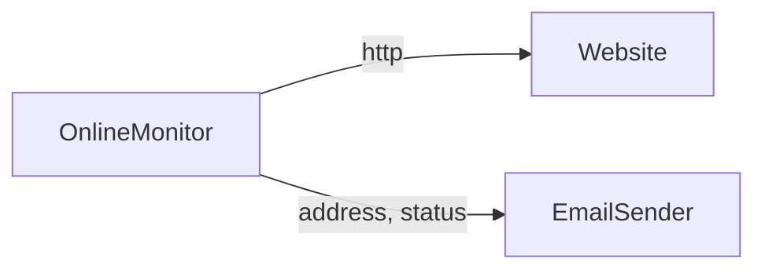
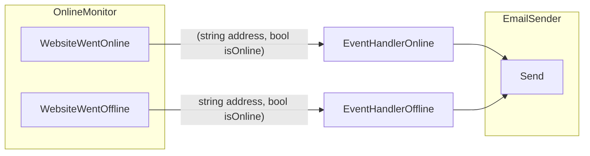

# Overview

## Komponenten Zusammenhänge

```mermaid
graph LR
	OnlineMonitor --http--> Website
	OnlineMonitor --address, status--> EmailSender
	EmailSender
	Website
```

## Eventreihenfolge

```mermaid
graph LR
	subgraph OnlineMonitor
		WebsiteWentOnline
		WebsiteWentOffline
	end
	subgraph EmailSender
		Send
	end
	WebsiteWentOnline --(string address, bool isOnline)--> EventHandlerOnline
	EventHandlerOnline --> Send
	WebsiteWentOffline --string address, bool isOnline)--> EventHandlerOffline
	EventHandlerOffline --> Send
```